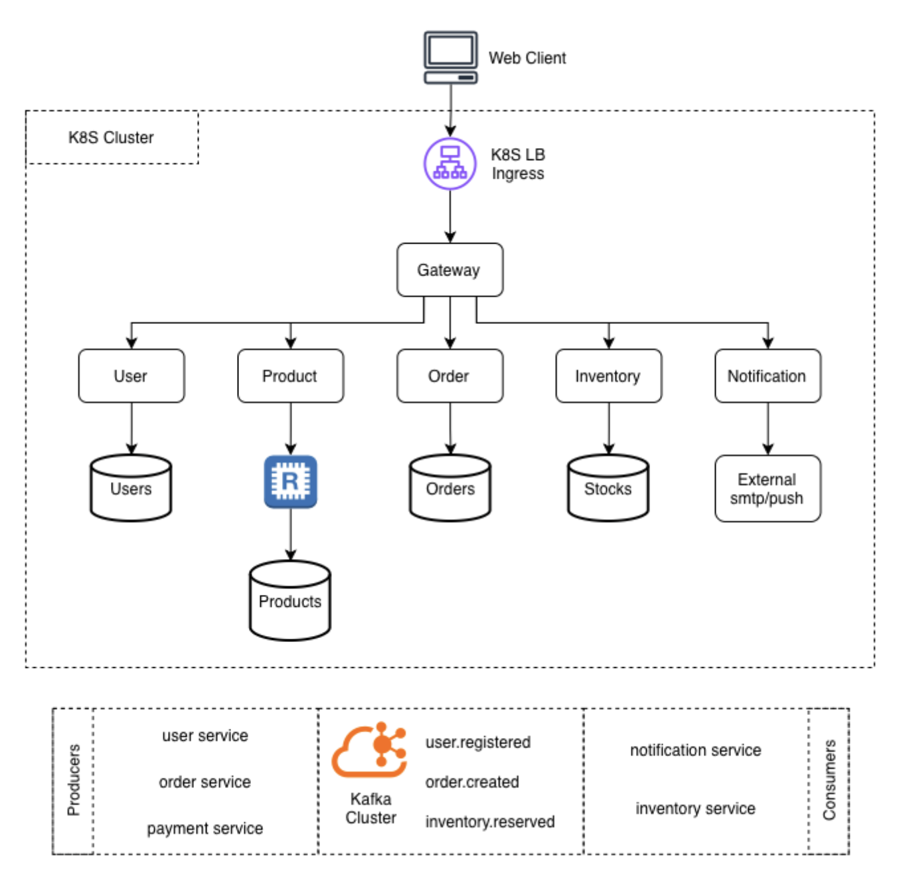

# Architecture

SmartShop is a **reactive microservices platform** built on Spring Boot 3.5 + WebFlux. Every service is non-blocking end-to-end: controllers return `Mono<T>` or `Flux<T>`, repositories use R2DBC or Spring Data Cassandra reactive, and inter-service messaging is asynchronous via Kafka.



## Service responsibilities

| Service | Responsibility | Database |
|---|---|---|
| Gateway | JWT validation, routing, distributed tracing | — |
| User | Registration, login, profile | PostgreSQL |
| Order | Order lifecycle, outbox publisher | PostgreSQL |
| Product | Catalog reads (high throughput) | Cassandra + Redis |
| Payment | Stripe / PayPal processing, webhook receiver | PostgreSQL |
| Inventory | Stock levels, reservation | PostgreSQL |
| Notification | Email dispatch | Kafka consumer only |

## Package layout (all services)

```
controller/    REST endpoints
service/       Interface + Impl pattern
repository/    R2DBC or Cassandra repos
entity/        Domain entities  (@Data, @Builder)
dto/           Request/Response records  (@Valid)
kafka/         Producers and consumers
event/         Kafka event models
config/        Security, Kafka, DB, OpenAPI config
mapper/        MapStruct DTO ↔ Entity
exception/     Custom exceptions + GlobalExceptionHandler
```

## Key design decisions

- **Reactive all the way down** — no `block()` in production code; the event loop is never blocked.
- **Outbox pattern** — Order and Payment services write Kafka events via an outbox table + scheduler to guarantee at-least-once delivery without distributed transactions.
- **Query-first Cassandra** — Product data is duplicated across multiple tables (`products_by_id`, `products_by_sku`, `products_by_category`) to serve each read pattern with a single-partition query.
- **Resilience4j** — Circuit breaker on the Order → Product Service client call.
